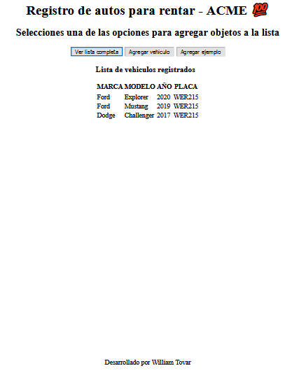

# registerCars

## Aplicacion en HTML / CSS / JS para registrar vehiculos

    

Proyecto para el curso base de JS de Platzi en el cual se pone en practica los conceptos de objetos y loops

Aun no tiene CSS, espere actualizaciones :V

    Puedes probar la aplicacion en el siguiente Link!

(https://williamtovar.github.io/registerCars/)

## Autores ✒️

* **William A. Tovar R.** - *Desarrollador* - [williamtovar](https://github.com/williamtovar)

## Expresiones de Gratitud 🎁

* Muchas gracias a [DaniekTJ](https://github.com/daniektj) por su contribucion en Platzi que sirvio de insipiracion para este proyecto - Link (https://github.com/daniektj/Reto-con-Objects-y-Funcion-constructora)
